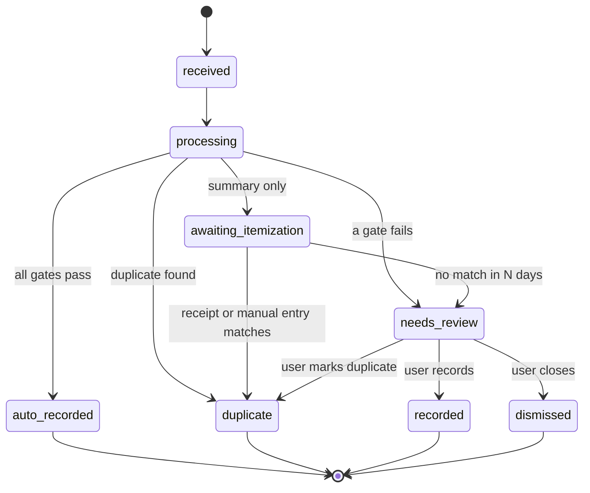

# YAFFA Fast Transaction Entry — Concept

As of 2026-10-02 · Gergely Kántor

> This is the agreed product concept. The implementation handoff is [specification.md](specification.md), and it wins where the two differ. Corrections made after checking the code (2026-10-02): account identifiers reuse alias lines (no identifier field exists); payee settings live on the `payees` config table; lifecycle statuses map onto the existing `AiDocument` statuses; the Wilson bound uses z = 1.645; auto-recording needs a global opt-in.

## Context and principles

YAFFA will speed up entry of repetitive transactions through reusable templates and confidence-based auto-recording of AI documents, without giving up user control. Status: concept agreed, no code yet.

Product principles that every part of this spec follows:

- **Manual control and awareness beat speed.** A vague transaction recorded quickly is worse than a held document that asks for a decision.
- **The Transaction model stays hardened.** Every Transaction has all required properties. Anything incomplete (templates, held documents) lives in separate models and never becomes a partial Transaction.
- **The system never changes a recorded transaction.** Late documents can only be linked or flagged. The user can still edit anything, for example during reconciliation.
- **Manual entry is never blocked.** Checks run in the background and only warn.
- **Auto-recorded transactions are normal transactions.** They count in all reports and calculations immediately.

## Requirements and use cases

Four requirements drive the design. Each row names the part of the spec that answers it.

| # | Requirement | Example | Answered by |
| --- | --- | --- | --- |
| R1 | A stub for repetitive transactions on an irregular schedule, adjusting as few fields as possible (date, account, occasionally amount) | Parking: same payee, same amount 9 times out of 10, one item | Transaction templates |
| R2 | A rule or confidence threshold that lets AI documents be recorded automatically as normal transactions | Same parking charge arriving as a banking notification | Auto-recording gates, payee settings |
| R3 | Auto-recording must work with only date, payee and amount, for payees whose history is predictable | Most restaurants and petrol stations: almost always one item, one category | Payee profile, completeness policy |
| R4 | Duplicate detection across transactions and AI documents, which may arrive at different times | Lunch: notification is enough, record it. Groceries: notification is useless; receipt scanned days or weeks later, or entered manually | Document lifecycle, two-way duplicate detection |

## Transaction templates (R1)

A template is a saved, partial transaction draft with no schedule. Using one opens the normal transaction form pre-filled, with focus on the first empty field. For parking, that means entering the date and saving.

### Storage

- The draft is a `draft` JSON column using the **same schema the AI document processing returns** for draft properties. One code path (draft → pre-filled form) serves both templates and AI documents.
- A `schema_version` key is added to that shared schema, so AI document drafts carry it too. Drafts without it are read as version 1. One validator and migration path then covers every stored draft.
- There is no list of fields to prompt for. Fields missing from the draft are the ones the user fills in; every field stays editable.
- Dedicated columns only for what is queried or joined:
  - `user_id`, `name`
  - `payee_id`: the payee's account entity, **nullable**. Transfers and investment transactions have no payee, so their templates leave it empty and keep everything in the draft.
  - `is_featured`: shown in the dashboard widget
  - `last_used_at`, `use_count`: for sorting
- A template is linked to a payee only through `payee_id`; payees have no separate template setting. AI processing uses a payee's template for defaults only when the payee has exactly one template. With more than one, it falls back to the payee profile.

### Stale references

A draft can point to an account, category or payee that was later deleted or deactivated. On load, invalid references are treated as empty fields, and the template shows a notice so the user can fix it.

### Management (CRUD)

- A template list page with create, edit and delete.
- **Save as template** from an existing transaction: the fastest way to create one.
- Create and edit reuse the **transaction form in template mode**, with relaxed validation where every field is optional. No separate JSON editor.
- Saving a transaction from a template is a normal manual entry. It needs no review.

### Dashboard widget

- Shows featured templates as cards, each with a button that opens the pre-filled form.
- MVP: templates with `is_featured = true`, sorted by `use_count` or `last_used_at`, capped at a fixed number of cards by the widget.
- Later: a widget-specific selection and order, without changing the template model.

## Payees: profile, settings and aliases (R2, R3)

All auto-recording decisions are made per payee. Eligibility is learned from that payee's own transaction history, never assumed. Restaurants and petrol stations are typical examples, not special cases.

### Stored payee profile

The profile is stored, not computed on every document. It is recalculated by a queued job whenever a transaction for the payee is added, changed or deleted, and fully recalculated nightly outside business hours.

- Dominant category and its share of transactions
- Share of single-item transactions
- Amount stability: how often the most common amount occurs, and the usual range
- Typical account(s)
- Number of transactions (sample size)

### Default category is a candidate, not proof

A payee's existing default category is the natural candidate for the dominant category, but it does not qualify the payee by itself. Eligibility needs history showing single-item transactions in that category. A grocery store usually has a default category, yet its transactions carry 5–10 categories, so it never qualifies for summary recording.

### Payee settings

Stored on the payee's config record (`payees` table, next to the default category), not on the account entity, which accounts share.

| Setting | Values | Default |
| --- | --- | --- |
| Auto-record policy | Follow global / Always allow / Never | Follow global |
| Itemization expectation | Summary sufficient / Itemization expected | Summary sufficient |

- **Always allow** still requires every gate except the history threshold to pass.
- **Itemization expected** marks payees such as grocery stores, where a summary-only document is not enough to record (see the document lifecycle).

### Auto-record candidates page

Auto-recording is off until the user turns on the global switch in the AI settings. Once it is on, because the default policy is *Follow global*, a payee starts auto-recording on its own once its profile passes the threshold. A dedicated page makes this visible and tunable:

- Payees that auto-record today, with the numbers behind it
- Payees close to qualifying, and what is missing (for example 3 more transactions)
- Payees that look like *Itemization expected* (often multi-item) but are set to *Summary sufficient*, and the reverse
- Template candidates: payees whose transactions are nearly identical

Each row links to the payee's settings, so the user can switch a payee to *Never* or *Always allow* from there.

### Payee matching

Aliases and account identifiers both live in the existing free-text `alias` field (one entry per line) on the account entity. There is no separate identifier field: an account's card ending is an alias line such as `1234` or `*1234`. No new tables are needed: per-user volumes are small, matching runs in code, and a conflict (one alias on two payees) can be validated on save.

Document text is normalized, then matched in tiers. Exact and leading-token matches can auto-record; similarity matches only under strict conditions.

1. **Normalize** both sides: case, punctuation, legal suffixes (Kft., Zrt.), store numbers and other digit groups.
2. **Exact match** of the normalized text against a payee name or alias.
3. **Leading-token match**: the alias is the start of the document text, as whole words. Alias `OMV` matches both `OMV 4471 BUDAPEST` and `OMV 4472 DEBRECEN` without adding either.
4. **Similarity match** for OCR errors: never auto-records on its own. It suggests a payee in review, or qualifies only when the score is very high, it is the single best candidate by a clear margin, and the normalized alias is at least 4 characters.

When the user confirms a payee in review, YAFFA offers to add the document's leading words as an alias.

### Cold start

A payee with no history, or too little, never auto-records. Its documents go to review until its history passes the threshold.

## Auto-recording rules (R2, R3)

An AI document becomes a Transaction automatically only if every gate passes. Gates are checked separately rather than blended into one score, so a failure always has a clear reason. A failed gate sends the document to review.

| Gate | Passes when |
| --- | --- |
| 1. Extraction | Date, amount and payee text were read; the date is not in the future and the amount parses |
| 2. Payee | The payee text matches with high confidence: an exact or leading-token match after normalization, or a strict similarity match (see payee matching) |
| 0. Switch | Auto-recording is turned on in the user's AI settings (off by default) |
| 3. Policy | The payee's policy is not *Never* |
| 4. History | The payee's stored profile meets the threshold (below), or its policy is *Always allow* |
| 5. Account | An account is known: from the document (an account identifier such as a card ending), or from the payee's single template |
| 6. Completeness | The payee is *Summary sufficient*, or the document is itemized |
| 7. Amount | The amount is within the payee's usual range |
| 8. Duplicates | No same-event match exists (see duplicate detection) |

### History threshold

- A global setting, overridable per payee through the auto-record policy.
- Uses a **lower confidence bound** (Wilson) on the share of single-item transactions in the dominant category, plus a minimum number of transactions. Raw ratios are not used: 3 out of 3 looks like 100%.
- Starting values are listed under open items.

### What gets recorded

- A complete, standard Transaction: payee, date, amount, account, and one item with the payee's dominant category.
- When the payee has exactly one template, the template supplies the defaults instead of the profile.
- An itemized document records its own items.
- Every auto-recorded transaction gets an origin record with the reason it passed (see transaction origin and review).

### Account mapping

Account identifiers seen in documents (such as a card's last four digits) are matched against the alias lines of the account's account entity. Because the Transaction model requires an account, a document with no resolvable account can never auto-record. There is no payee-level default account: the account comes from the document or from a template the user set up deliberately.

## AI document lifecycle (R4)

Every AI document carries a status. A document never becomes an incomplete Transaction: it either passes every gate, waits, or goes to the user.

The names below are conceptual. In code, `received` is the existing `ready_for_processing`, `needs_review` is `ready_for_review`, `recorded` is `finalized`, and the existing `processing_failed` stays. Only `auto_recorded`, `duplicate`, `awaiting_itemization` and `dismissed` are new.

A summary-only document for an *Itemization expected* payee waits instead of being recorded. It closes on its own when the receipt or a manual entry matches it, and only reaches the user after N days with no match.

| Status | Meaning | Leaves by |
| --- | --- | --- |
| `received`, `processing` | Extraction and checks are running | The outcome of the checks |
| `auto_recorded` | Passed every gate and created a Transaction with an origin record | Terminal |
| `duplicate` | Matched an existing transaction or document; includes a held notification merged into its receipt | Terminal |
| `awaiting_itemization` | Summary-only document for an *Itemization expected* payee | A matching receipt or manual entry closes it; no match within N days moves it to `needs_review` |
| `needs_review` | A gate failed, a near match or conflict was found, or the itemization timeout passed | The user records it, marks it a duplicate, or dismisses it |
| `recorded` | The user created the transaction from the document; the origin record is saved as already reviewed | Terminal |
| `dismissed` | Closed by the user, for example as insufficient | Terminal; still visible to later duplicate checks |

## Duplicate detection (R4)

Duplicates are checked in both directions: when a document arrives, and when the user saves a transaction. The first decides what happens to the document; the second only warns.

### Matching key

- Exact amount
- Date within a window of ±3–5 days, to allow for card settlement lag
- Same resolved payee
- Same account, when both sides have one

A key match only makes two items **candidates**. Repeated identical purchases, such as the same parking fee on consecutive days or twice in one day, are real and must not be closed.

### Same purchase or a repeat?

Candidates count as the same purchase only with a same-event signal:

- Identical content hash or bank transaction reference
- Complementary sources: a notification and a receipt, not two documents of the same kind
- Timestamps within a few minutes, when both sides have one

Rules:

- Two documents of the same kind with different timestamps or references are separate events. Two parking notifications on one day both record.
- One to one: a transaction absorbs at most one document of each kind. A second notification can never be closed against a transaction already linked to a notification.
- A candidate with no same-event signal, and no clear sign of a separate event, goes to `needs_review`. It is never closed automatically.

### Incoming document

Checked against committed transactions (including auto-recorded ones), other documents that are still open, and held documents.

| Match found | Outcome |
| --- | --- |
| Same document again (same source or content hash) | Closed as `duplicate`, silently |
| A recorded transaction, with a same-event signal | Closed as `duplicate` and linked to the transaction. The transaction is never changed |
| A detailed receipt for an auto-recorded summary transaction whose details differ | Linked as a conflict and sent to review. The transaction is never changed |
| A held (`awaiting_itemization`) document | Merged: the receipt supplies the items, the notification the account and exact time. Then the normal gates apply |
| Candidate without a same-event signal, or a near match with a different amount | Sent to review. Typical causes: repeated purchases, petrol pre-authorization, tips, currency conversion |
| No match | Continue to the auto-recording gates |

### Manual or template entry

- Saving is **never blocked**.
- The check runs **before saving**, as soon as the account(s), payee, date and amount are filled in, and shows a non-blocking warning in the form.
- Matching **transactions** are shown for information only. Repeats are expected, so the user simply saves.
- Matching **open or held documents** are shown with a *close this document* action. This is how a grocery notification closes when the purchase is entered by hand.

### Race conditions

Documents may be processed in parallel. The duplicate check is repeated at commit time, or processing is serialized per user, so two documents for the same purchase cannot both be recorded.

## Transaction origin and review

The Transaction table does not change. No new transaction state is added. How a transaction came to exist, and whether a person has looked at it, is stored in a separate origin record.

### Three separate concepts

| Concept | Question it answers | Where it lives |
| --- | --- | --- |
| Lifecycle | Is this a real transaction yet? | AI document status (see document lifecycle) |
| Provenance and review | How was it created, and has a person checked it? | Transaction origin record |
| Reconciliation | Is it confirmed against a statement? | Existing `reconciled` flag, unchanged |

### Origin record

- `transaction_id`
- `origin_type` + `origin_id`: a polymorphic relation (`morphTo`) to the source, currently an AI document
- `relation`: `created`, `duplicate_of` or `conflicts_with`
- `decision_reason`: why it was auto-recorded, for example "47 of 49 past transactions in Dining, amount within usual range, account from card ending 1234"
- `reviewed_at`: nullable

### Review

- Manually entered transactions, including ones from a template, have no origin record and need no review.
- An **Auto-recorded, unreviewed** list shows origin records with `relation = created` and no `reviewed_at`, with one-click confirm.
- Review is optional. Reconciling an auto-recorded transaction also sets `reviewed_at`.
- Records with `relation = conflicts_with` are shown so the user can decide what to do. The system does not change the transaction.

## Data model summary

Three new tables, new fields on existing entities, and no change to Transaction.

| Entity | New or changed | Key fields |
| --- | --- | --- |
| `transaction_templates` | New | `user_id`, `name`, `payee_id` (nullable), `draft` (JSON), `is_featured`, `use_count`, `last_used_at` |
| `transaction_origins` | New | `transaction_id`, `origin_type`, `origin_id`, `relation`, `decision_reason`, `reviewed_at` |
| `payee_profiles` | New | Payee's account entity, stored profile metrics, `calculated_at`. Recalculated by a queued job on transaction changes and nightly |
| Payees (`payees` config table) | Changed | `auto_record_policy`, `itemization_expected`. Existing `account_entities.alias` reused for matching |
| Account entities (accounts) | Unchanged | Existing `alias` lines reused for account mapping (card endings) |
| AI document draft schema | Changed | `schema_version` key, also used by templates |
| AI documents | Changed | Lifecycle `status`, content hash for exact duplicates, `status_changed_at` for the itemization timeout |
| AI processing settings | Changed | Global auto-record switch (default off), history threshold (lower bound, minimum count), itemization timeout in days, duplicate date window, similarity match threshold |
| `transactions` | Unchanged | — |

## Out of scope and open items

### Out of scope for this spec

- **Review of auto-recorded scheduled transactions.** The polymorphic origin record leaves room to add schedules as a source later.
- **Shadow mode** for calibrating the history threshold before enabling auto-recording.
- **Splitting one receipt into several transactions** during review.

### Open items

Suggested starting values, to be tuned during development. All live in the AI processing settings unless noted.

| Setting | Starting value | Reasoning |
| --- | --- | --- |
| History threshold | Wilson lower bound ≥ 0.80 at 90% two-sided confidence (z = 1.645), on the share of single-item transactions in the dominant category | 11 of 11 qualifies, 20 of 21 qualifies, 18 of 20 does not. Raw 90% is not enough when one in ten is an exception |
| Minimum history | 10 transactions | Below this, even a perfect record is too thin. With the bound above, 10 of 10 just misses and 11 of 11 passes |
| Amount gate | Within ±20% of the payee's median amount, or equal to an amount seen before | Lets routine variation through; a tenfold amount goes to review |
| Itemization timeout | 14 days | Receipts usually get scanned within days or a couple of weeks; later than that, a reminder is useful |
| Duplicate date window | ±3 days | Covers card settlement lag between purchase and booking |
| Timestamp same-event window | 10 minutes | Notifications arrive almost instantly; receipt and card times can differ by a few minutes |
| Similarity match | Normalized similarity ≥ 0.92, margin ≥ 0.10 over the second-best payee, alias ≥ 4 characters after normalization | Tolerates one or two OCR errors in a typical name, never picks between two close candidates |
| Normalization tokens | Case, punctuation, digit groups, legal suffixes (Kft, Zrt, Bt, Nyrt, Kkt, Ltd, GmbH) | City names are not stripped at first: leading-token matching already ignores whatever follows the alias |
